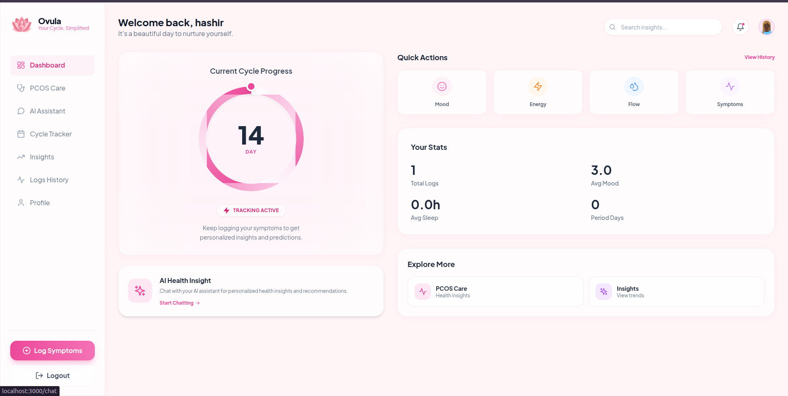
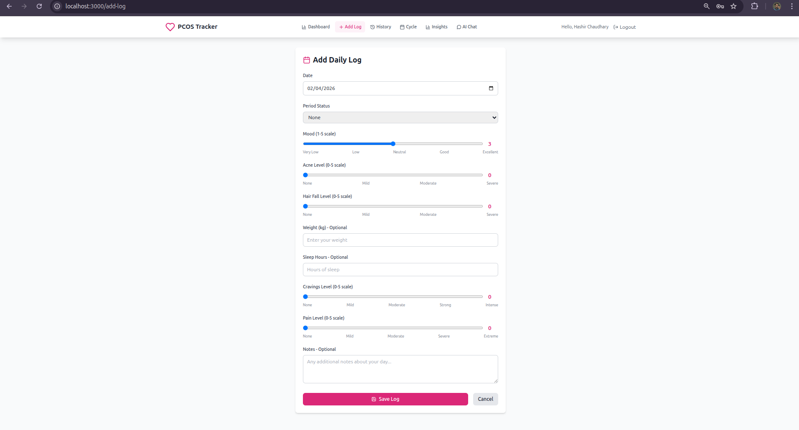
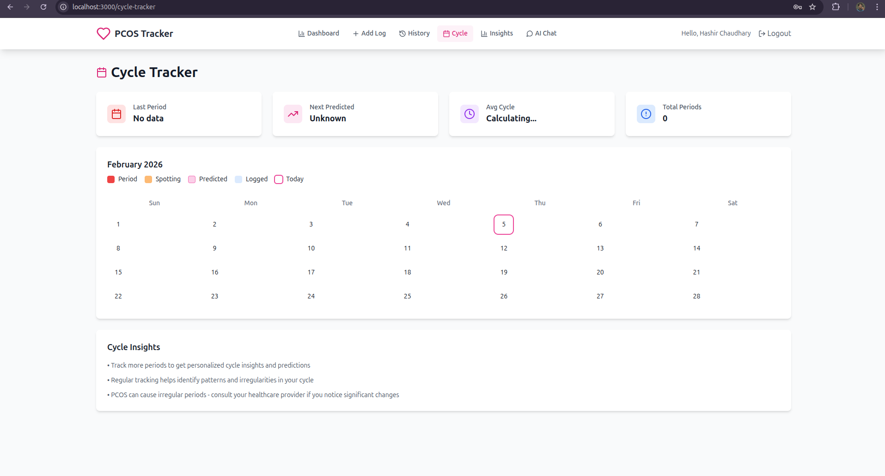
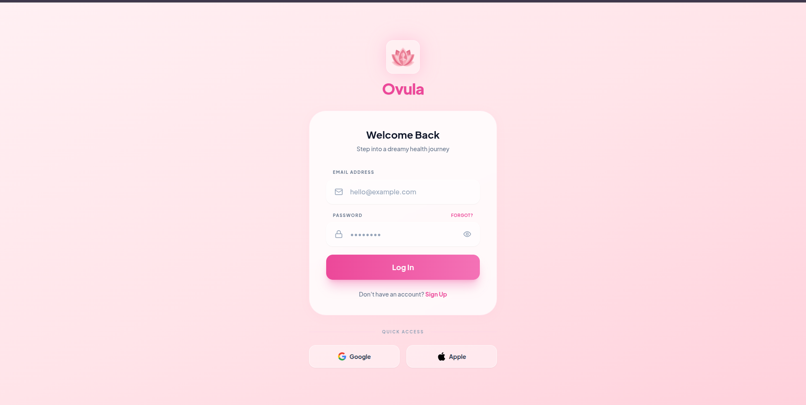
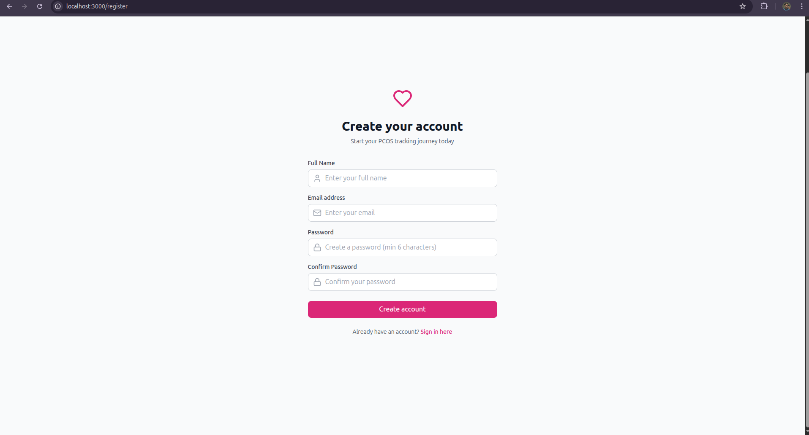

<div align="center">

# 🌸 Ovula

### AI-Powered PCOS Tracking & Management System

*Empowering women with intelligent health tracking and personalized insights*

[](https://www.python.org/downloads/)
[](https://reactjs.org/)
[](https://fastapi.tiangolo.com/)
[](LICENSE)

[Features](#-features) • [Quick Start](#-quick-start) • [Documentation](#-api-endpoints) • [Team](#-team)

</div>

---

## 🎓 Academic Project

<table>
<tr>
<td><strong>🏛️ University</strong></td>
<td>FAST National University of Computer and Emerging Sciences</td>
</tr>
<tr>
<td><strong>📍 Campus</strong></td>
<td>Peshawar</td>
</tr>
<tr>
<td><strong>📚 Project Type</strong></td>
<td>Final Year Project (FYP)</td>
</tr>
<tr>
<td><strong>👨‍🏫 Supervisor</strong></td>
<td>Shahzeb Khan</td>
</tr>
</table>

### 👥 Team Members

| Name | Registration Number | GitHub |
|------|---------------------|--------|
| **Muhammad Hashir** | 22P-9181 | [@hashir](https://github.com/hashirch) |
| **Laraib Shahid Abbasi** | 22P-0503 | [@laraib]() |
| **Arooba Gohar** | 22P-9216 | [@arooba](https://github.com/uroobagh123) |

---

## � About Ovula

Ovula is a comprehensive health management platform designed specifically for women with PCOS (Polycystic Ovary Syndrome). The system combines daily symptom tracking, menstrual cycle monitoring, and AI-powered chatbot assistance to provide personalized health insights and support.

### 🎯 Problem Statement

PCOS affects 1 in 10 women worldwide, yet many struggle to track symptoms and understand patterns in their condition. Ovula addresses this by providing an intelligent, easy-to-use platform that helps women monitor their health and receive AI-powered guidance.

### � Our Solution

- **🔍 Smart Tracking**: Log daily symptoms with an intuitive interface
- **🤖 AI Assistant**: Get instant answers to PCOS-related questions using fine-tuned language models
- **📊 Visual Insights**: Understand your health patterns through interactive charts
- **📅 Cycle Monitoring**: Track menstrual cycles and predict patterns
- **🔒 Secure & Private**: Your health data stays protected with industry-standard security

---

## 📸 Screenshots

> **📝 Note**: To add screenshots, place PNG images in the `docs/screenshots/` folder with the filenames shown below. See [Screenshot Guide](docs/SCREENSHOTS_GUIDE.md) for detailed instructions.

<div align="center">

### 🏠 Dashboard

*Main dashboard showing health overview and quick actions*

### 💬 AI Chatbot

*Interactive AI assistant for PCOS-related queries*

### 📝 Daily Log Entry

*Easy-to-use form for tracking daily symptoms*

### 📅 Cycle Tracker

*Menstrual cycle monitoring and predictions*

### 🔐 Authentication
<table>
<tr>
<td width="50%">

<p align="center"><em>Login Page</em></p>
</td>
<td width="50%">

<p align="center"><em>Registration Page</em></p>
</td>
</tr>
</table>

</div>

---

## ✨ Features

<table>
<tr>
<td width="50%">

### 🔐 User Management
- Secure registration & login
- Email verification via OTP
- JWT-based authentication
- Password encryption

</td>
<td width="50%">

### 📝 Daily Logging
- Mood tracking (1-5 scale)
- Acne & hair fall severity
- Weight & BMI monitoring
- Sleep hours tracking

</td>
</tr>
<tr>
<td width="50%">

### 🤖 AI Chatbot
- Multiple AI models support
- PCOS-specific knowledge
- Conversation history
- Real-time responses

</td>
<td width="50%">

### 📊 Analytics
- Trend visualization
- Pattern recognition
- Health insights
- Cycle predictions

</td>
</tr>
</table>

---

## 🏗️ Technology Stack

### Backend
```
🐍 Python 3.8+          - Core language
⚡ FastAPI              - Web framework
🗄️ SQLAlchemy          - ORM
🔐 JWT & Bcrypt         - Security
🤖 Ollama               - AI inference
```

### Frontend
```
⚛️ React 18             - UI framework
🎨 Tailwind CSS         - Styling
📊 Recharts             - Data visualization
🔄 React Router         - Navigation
📡 Axios                - HTTP client
```

### AI Models
```
🦙 Llama 3              - Base model
💎 Gemma 2              - Alternative model
🌟 Mistral              - Alternative model
🎯 Custom Fine-tuned    - PCOS-specific model
```

---

## 🚀 Quick Start

### Prerequisites

Before you begin, ensure you have the following installed:

- ✅ **Python 3.8+** - [Download](https://www.python.org/downloads/)
- ✅ **Node.js 16+** - [Download](https://nodejs.org/)
- ✅ **Ollama** - [Install Guide](https://ollama.ai/)
- ✅ **Git** - [Download](https://git-scm.com/)

### Installation Steps

#### 1️⃣ Clone the Repository

```bash
git clone https://github.com/your-username/ovula.git
cd ovula
```

#### 2️⃣ Backend Setup

```bash
# Navigate to backend directory
cd backend

# Create virtual environment
python3 -m venv venv

# Activate virtual environment
source venv/bin/activate  # On Windows: venv\Scripts\activate

# Install dependencies
pip install -r requirements.txt

# Create environment file
cp .env.example .env
# Edit .env with your configuration
```

#### 3️⃣ Frontend Setup

```bash
# Navigate to frontend directory
cd frontend

# Install dependencies
npm install
```

#### 4️⃣ Install AI Models

```bash
# Start Ollama service
ollama serve

# Pull the base model (in a new terminal)
ollama pull llama3

# Optional: Pull alternative models
ollama pull gemma2
ollama pull mistral
```

#### 5️⃣ Run the Application

**Option A: Using the automated script** (Recommended)
```bash
./scripts/run_system.sh
```

**Option B: Manual start**
```bash
# Terminal 1 - Backend
cd backend
python main.py

# Terminal 2 - Frontend
cd frontend
npm start
```

### 🎉 Access the Application

- **Frontend**: http://localhost:3000
- **Backend API**: http://localhost:8000
- **API Documentation**: http://localhost:8000/docs

---

## ⚙️ Configuration

### Environment Variables

Create a `backend/.env` file with the following configuration:

```env
# ============================================
# AI Model Configuration
# ============================================
MODEL_TYPE=ollama_base
# Options: ollama_base, ollama_finetuned, ollama_gemma, ollama_mistral

OLLAMA_BASE_URL=http://localhost:11434
OLLAMA_BASE_MODEL=llama3
OLLAMA_FINETUNED_MODEL=pcos-llama3

# Alternative Models
OLLAMA_GEMMA_MODEL=gemma2
OLLAMA_MISTRAL_MODEL=mistral

# ============================================
# Database Configuration
# ============================================
DATABASE_URL=sqlite:///./pcos_tracker.db

# ============================================
# Security Configuration
# ============================================
SECRET_KEY=your-super-secret-key-change-this-in-production
ALGORITHM=HS256
ACCESS_TOKEN_EXPIRE_MINUTES=30

# ============================================
# Chat Configuration
# ============================================
MAX_CHAT_HISTORY=10
MAX_RESPONSE_LENGTH=512
```

### Supported AI Models

| Model Type | Description | Use Case |
|------------|-------------|----------|
| `ollama_base` | Llama 3 base model | General purpose |
| `ollama_finetuned` | Custom PCOS model | PCOS-specific responses |
| `ollama_gemma` | Google Gemma 2 | Alternative option |
| `ollama_mistral` | Mistral AI | Alternative option |
| `lora_pipeline` | LoRA fine-tuned | Advanced customization |

---

## 📁 Project Structure

```
ovula/
│
├── 📂 backend/                          # Backend Application (FastAPI)
│   │
│   ├── 📂 app/                          # Core application package
│   │   ├── 📂 models/                   # Database models
│   │   │   ├── __init__.py
│   │   │   └── chat.py                  # Chat message models
│   │   │
│   │   ├── 📂 routes/                   # API route handlers
│   │   │   ├── __init__.py
│   │   │   └── chat.py                  # Chat endpoints
│   │   │
│   │   ├── 📂 services/                 # Business logic layer
│   │   │   ├── __init__.py
│   │   │   └── llm_service.py           # AI/LLM integration service
│   │   │
│   │   ├── __init__.py
│   │   └── config.py                    # Application configuration
│   │
│   ├── 📂 routers/                      # FastAPI routers
│   │   ├── __init__.py
│   │   ├── auth.py                      # Authentication routes
│   │   ├── logs.py                      # Daily logs routes
│   │   └── insights.py                  # Analytics routes
│   │
│   ├── main.py                          # FastAPI app entry point
│   ├── database.py                      # Database connection & session
│   ├── database_schema.sql              # Complete SQL schema
│   ├── models.py                        # SQLAlchemy ORM models
│   ├── schemas.py                       # Pydantic validation schemas
│   ├── auth.py                          # JWT authentication logic
│   ├── otp_service.py                   # Email OTP service
│   ├── start_server.py                  # Server startup script
│   ├── requirements.txt                 # Python dependencies
│   ├── .env                             # Environment variables
│   └── pcos_tracker.db                  # SQLite database file
│
├── 📂 frontend/                         # Frontend Application (React)
│   │
│   ├── 📂 public/                       # Static files
│   │   └── index.html                   # HTML template
│   │
│   ├── 📂 src/                          # Source code
│   │   │
│   │   ├── 📂 components/               # Reusable UI components
│   │   │   └── Navbar.js                # Navigation bar component
│   │   │
│   │   ├── 📂 contexts/                 # React Context API
│   │   │   └── AuthContext.js           # Authentication context
│   │   │
│   │   ├── 📂 pages/                    # Page components (routes)
│   │   │   ├── Login.js                 # Login page
│   │   │   ├── Register.js              # Registration page
│   │   │   ├── VerifyEmail.js           # Email verification page
│   │   │   ├── Dashboard.js             # Main dashboard
│   │   │   ├── AddLog.js                # Add daily log page
│   │   │   ├── LogsHistory.js           # View all logs
│   │   │   ├── Chat.js                  # AI chatbot page
│   │   │   ├── Insights.js              # Analytics & insights
│   │   │   └── CycleTracker.js          # Menstrual cycle tracker
│   │   │
│   │   ├── App.js                       # Main app component & routing
│   │   ├── index.js                     # React entry point
│   │   └── index.css                    # Global styles (Tailwind)
│   │
│   ├── package.json                     # Node dependencies
│   ├── package-lock.json                # Locked dependencies
│   ├── tailwind.config.js               # Tailwind CSS configuration
│   └── postcss.config.js                # PostCSS configuration
│
├── 📂 data/                             # AI Training Datasets
│   ├── allData.json                     # Complete dataset
│   ├── clean_data.json                  # Cleaned dataset
│   ├── OnlyPCOS.json                    # PCOS-specific data
│   ├── pcos_dataset.jsonl               # Training data (JSONL)
│   ├── pcos_comprehensive_dataset.jsonl # Extended training data
│   ├── pcos_training_complete.jsonl     # Complete training set
│   └── concise_training_dataset.jsonl   # Concise training set
│
├── 📂 rag/                              # RAG (Retrieval-Augmented Generation)
│   ├── README.md                        # RAG documentation
│   ├── embeddings.py                    # Vector embeddings
│   └── retriever.py                     # Document retrieval logic
│
├── 📂 scripts/                          # Utility Scripts
│   ├── run_system.sh                    # Start entire system
│   ├── run_server.sh                    # Start backend only
│   ├── create_custom_model.sh           # Fine-tune AI model
│   ├── create_training_dataset.py       # Generate training data
│   ├── generate_concise_dataset.py      # Create concise dataset
│   ├── install_all_dependencies.sh      # Install all dependencies
│   ├── install_db_viewer.sh             # Install DB viewer tool
│   └── view_database.sh                 # View database contents
│
├── 📂 docs/                             # Documentation
│   ├── 📂 screenshots/                  # Application screenshots
│   │   ├── README.md                    # Screenshot guidelines
│   │   ├── PLACEHOLDER.md               # Placeholder generation guide
│   │   ├── dashboard.png                # Dashboard screenshot
│   │   ├── chat.png                     # AI chat screenshot
│   │   ├── add-log.png                  # Add log screenshot
│   │   ├── cycle-tracker.png            # Cycle tracker screenshot
│   │   ├── login.png                    # Login page screenshot
│   │   └── register.png                 # Register page screenshot
│   └── SCREENSHOTS_GUIDE.md             # Quick screenshot guide
│
├── .gitignore                           # Git ignore rules
├── check_status.sh                      # System status checker
└── README.md                            # This file
```

### 📝 Key Files Explained

#### Backend Core Files

| File | Purpose |
|------|---------|
| `main.py` | FastAPI application initialization, CORS setup, router registration |
| `database.py` | SQLAlchemy engine, session management, database connection |
| `models.py` | ORM models for users, logs, chat messages, cycles |
| `schemas.py` | Pydantic models for request/response validation |
| `auth.py` | JWT token creation, password hashing, user authentication |
| `otp_service.py` | Email verification OTP generation and validation |
| `config.py` | Environment variables, model configuration, app settings |

#### Frontend Core Files

| File | Purpose |
|------|---------|
| `App.js` | Main component with React Router setup and protected routes |
| `AuthContext.js` | Global authentication state management |
| `Navbar.js` | Navigation bar with user menu and logout |
| `Dashboard.js` | Main dashboard with health overview and quick actions |
| `Chat.js` | AI chatbot interface with message history |
| `AddLog.js` | Form for adding daily symptom logs |
| `Insights.js` | Data visualization and trend analysis |

#### AI/ML Files

| File | Purpose |
|------|---------|
| `llm_service.py` | LLM integration (Ollama, HuggingFace, OpenAI) |
| `embeddings.py` | Vector embeddings for RAG |
| `retriever.py` | Document retrieval for context-aware responses |
| `pcos_dataset.jsonl` | Training data for fine-tuning models |

#### Utility Scripts

| Script | Purpose |
|--------|---------|
| `run_system.sh` | One-command startup for frontend + backend + Ollama |
| `create_custom_model.sh` | Fine-tune Llama 3 on PCOS data |
| `create_training_dataset.py` | Generate training data from JSON files |
| `view_database.sh` | Open SQLite database in viewer |

---

## 🔌 API Endpoints

### 🔐 Authentication

| Method | Endpoint | Description |
|--------|----------|-------------|
| `POST` | `/auth/register` | Register new user |
| `POST` | `/auth/verify-email` | Verify email with OTP |
| `POST` | `/auth/resend-otp` | Resend verification code |
| `POST` | `/auth/login` | User login |
| `GET` | `/auth/me` | Get current user info |

### 📝 Daily Logs

| Method | Endpoint | Description |
|--------|----------|-------------|
| `POST` | `/logs/` | Create new daily log |
| `GET` | `/logs/` | Get all user logs |
| `GET` | `/logs/{id}` | Get specific log |
| `PUT` | `/logs/{id}` | Update log |
| `DELETE` | `/logs/{id}` | Delete log |

### 🤖 AI Chat

| Method | Endpoint | Description |
|--------|----------|-------------|
| `POST` | `/chat/` | Send message to AI |
| `GET` | `/chat/history` | Get chat history |

### 📊 Insights

| Method | Endpoint | Description |
|--------|----------|-------------|
| `GET` | `/insights/summary` | Get health summary |
| `GET` | `/insights/trends` | Get trend analysis |

**📚 Full API Documentation**: Visit http://localhost:8000/docs after starting the backend

---

## 🗄️ Database Schema

The system uses **SQLite** with a well-structured schema:

### Core Tables

| Table | Purpose |
|-------|---------|
| `users` | User accounts and authentication |
| `otp_tokens` | Email verification codes |
| `daily_logs` | Daily symptom tracking data |
| `chat_messages` | AI conversation history |
| `cycle_data` | Menstrual cycle tracking |
| `user_sessions` | Login session management |
| `user_preferences` | User settings and preferences |

### Key Features
- ✅ Foreign key constraints
- ✅ Automatic timestamps
- ✅ Data validation triggers
- ✅ Optimized indexes
- ✅ Cascade delete operations

**📄 Full Schema**: See `backend/database_schema.sql`

---

## 🤖 Training Your Own AI Model

Want to create a custom PCOS-specific model? Follow these steps:

### Step 1: Prepare Training Data
```bash
python scripts/create_training_dataset.py
```

### Step 2: Create Fine-tuned Model
```bash
./scripts/create_custom_model.sh
```

### Step 3: Update Configuration
```bash
# Edit backend/.env
MODEL_TYPE=ollama_finetuned
OLLAMA_FINETUNED_MODEL=pcos-llama3
```

### Step 4: Restart Backend
```bash
cd backend
python main.py
```

---

## 🧪 Testing

### Backend Tests
```bash
cd backend
pytest
```

### Frontend Tests
```bash
cd frontend
npm test
```

### Manual Testing
1. Register a new account
2. Verify email with OTP
3. Log in to the dashboard
4. Create a daily log entry
5. Chat with the AI assistant
6. View insights and trends

---

## � Deployment

### Backend Deployment

**Using Gunicorn (Production)**
```bash
pip install gunicorn
gunicorn -w 4 -k uvicorn.workers.UvicornWorker main:app --bind 0.0.0.0:8000
```

**Using Docker**
```dockerfile
FROM python:3.9
WORKDIR /app
COPY requirements.txt .
RUN pip install -r requirements.txt
COPY . .
CMD ["uvicorn", "main:app", "--host", "0.0.0.0", "--port", "8000"]
```

### Frontend Deployment

**Build for Production**
```bash
cd frontend
npm run build
```

**Deploy to Netlify/Vercel**
- Build command: `npm run build`
- Publish directory: `build`

---

## 🛠️ Troubleshooting

### Common Issues

<details>
<summary><b>❌ Ollama connection failed</b></summary>

```bash
# Check if Ollama is running
ollama list

# Start Ollama service
ollama serve

# Test the model
ollama run llama3 "Hello"
```
</details>

<details>
<summary><b>❌ Database not found</b></summary>

```bash
# Recreate database
rm backend/pcos_tracker.db
cd backend
python main.py
```
</details>

<details>
<summary><b>❌ CORS errors</b></summary>

Check `backend/main.py` CORS settings:
```python
allow_origins=["http://localhost:3000"]
```
</details>

<details>
<summary><b>❌ Port already in use</b></summary>

```bash
# Kill process on port 8000
lsof -ti:8000 | xargs kill -9

# Kill process on port 3000
lsof -ti:3000 | xargs kill -9
```
</details>

---

## 🤝 Contributing

We welcome contributions! Here's how you can help:

1. 🍴 Fork the repository
2. 🌿 Create a feature branch (`git checkout -b feature/amazing-feature`)
3. 💾 Commit your changes (`git commit -m 'Add amazing feature'`)
4. 📤 Push to the branch (`git push origin feature/amazing-feature`)
5. 🔃 Open a Pull Request

### Development Guidelines

- Follow PEP 8 for Python code
- Use ESLint for JavaScript code
- Write meaningful commit messages
- Add tests for new features
- Update documentation as needed

---

## 📄 License

This project is licensed under the **MIT License** - see the [LICENSE](LICENSE) file for details.

---

## 🙏 Acknowledgments

Special thanks to:

- **FAST NUCES Peshawar** for providing resources and support
- **Shahzeb Khan** for supervision and guidance
- [Ollama](https://ollama.ai/) for local LLM inference
- [FastAPI](https://fastapi.tiangolo.com/) for the excellent backend framework
- [React](https://react.dev/) for the powerful frontend library
- The open-source community for amazing tools and libraries

---

## 📧 Contact & Support

### Team Contact

- **Muhammad Hashir**: hashir.22pwbcsf9181@student.nu.edu.pk
- **Laraib Shahid Abbasi**: laraib.22pwbcsf0503@student.nu.edu.pk
- **Arooba Gohar**: arooba.22pwbcsf9216@student.nu.edu.pk

### Getting Help

- 📖 Check the [Documentation](#-api-endpoints)
- 🐛 Report bugs via GitHub Issues
- 💬 Contact the team via email
- 📧 Reach out to supervisor: Shahzeb Khan

---

## 🔮 Future Roadmap

### Phase 1 (Current)
- [x] User authentication system
- [x] Daily symptom logging
- [x] AI chatbot integration
- [x] Basic insights dashboard

### Phase 2 (Planned)
- [ ] Mobile app (React Native)
- [ ] Advanced analytics with ML predictions
- [ ] Export data to PDF/CSV
- [ ] Multi-language support
- [ ] Push notifications

### Phase 3 (Future)
- [ ] Integration with wearable devices
- [ ] Community features and forums
- [ ] Telemedicine integration
- [ ] Doctor consultation booking
- [ ] Medication reminders

---

## ⚠️ Disclaimer

**Important**: Ovula is designed for informational and tracking purposes only. It is **not a substitute for professional medical advice, diagnosis, or treatment**. Always consult with qualified healthcare providers regarding any medical conditions or concerns.

---

<div align="center">

### ⭐ Star this repository if you find it helpful!

Made with ❤️ by the Ovula Team at FAST NUCES Peshawar

**[⬆ Back to Top](#-ovula)**

</div>
