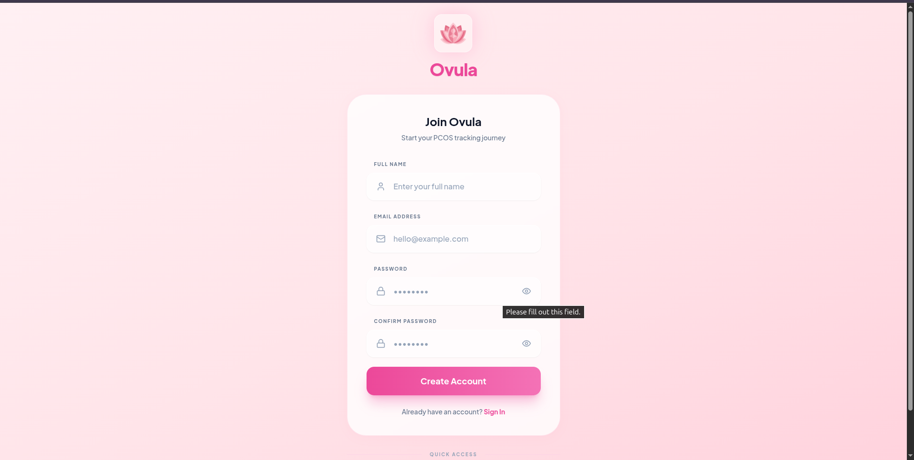
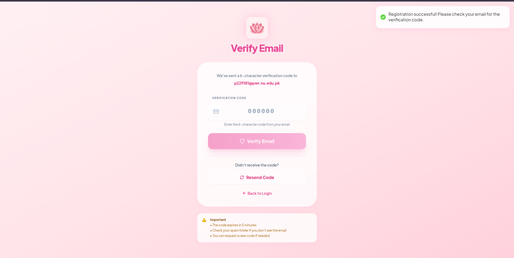
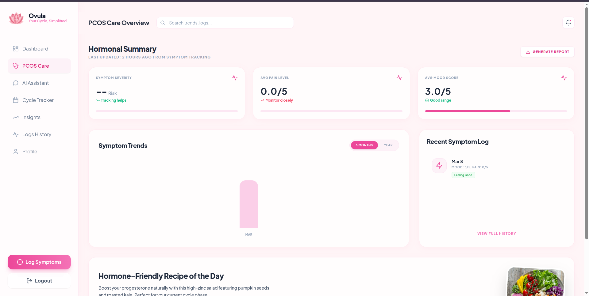
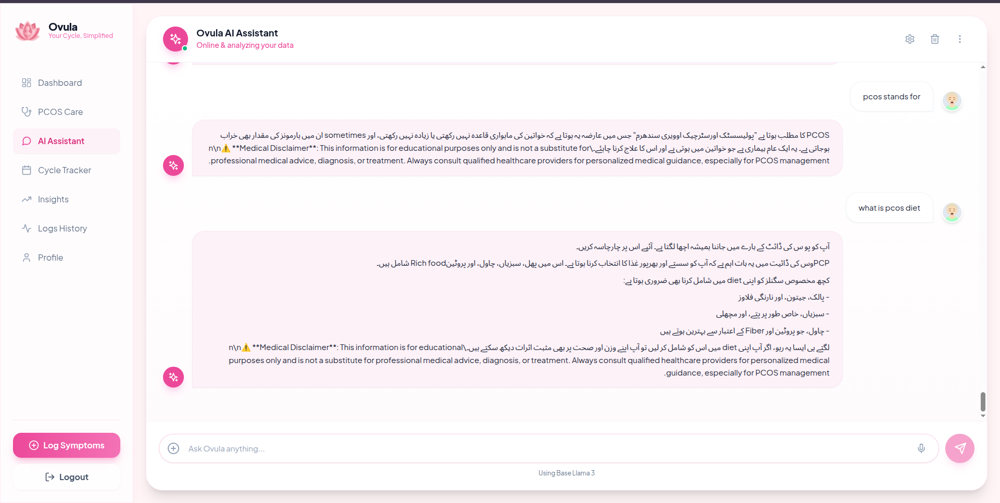
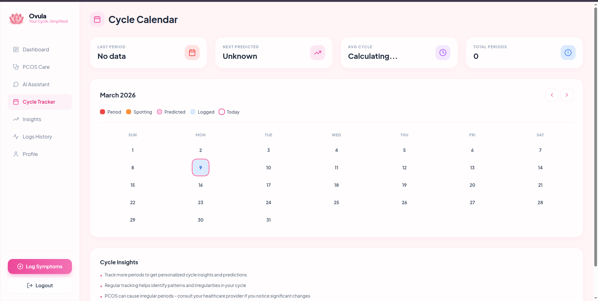
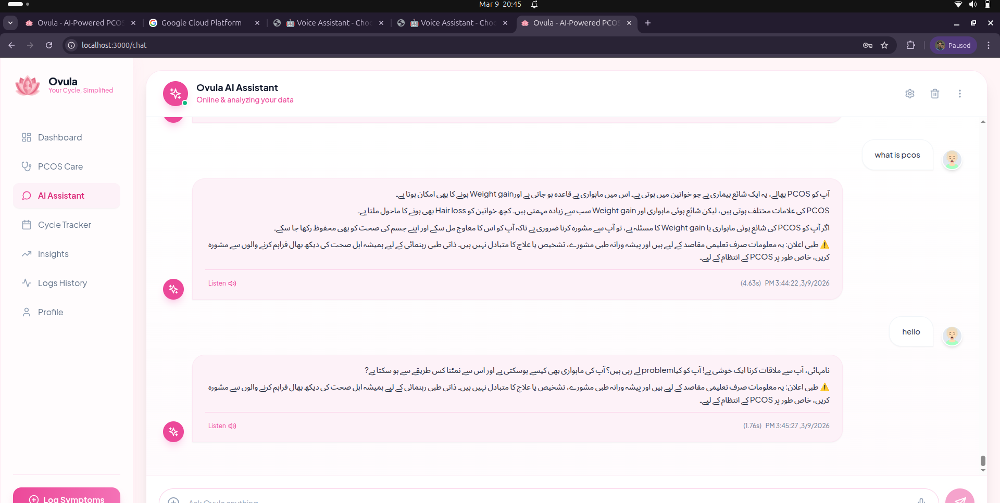
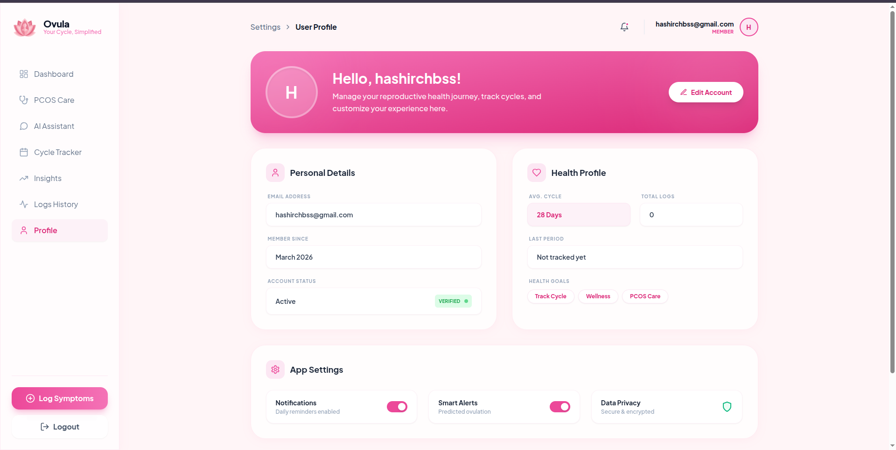
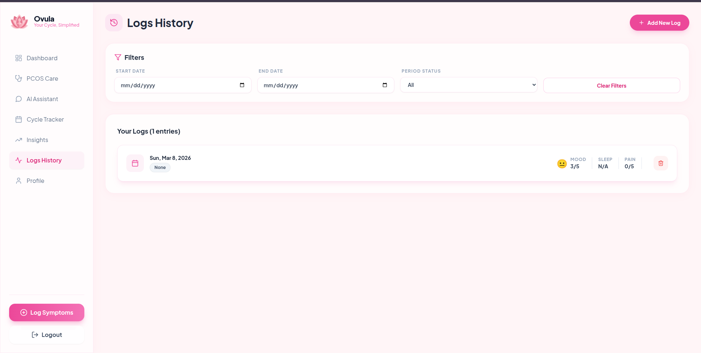
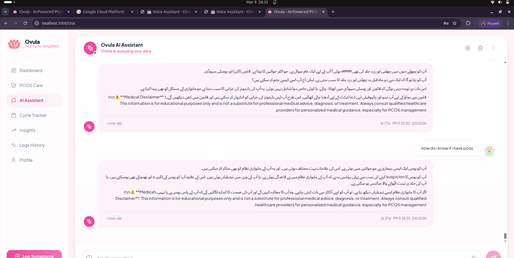

<div align="center">


# Ovula

### PCOS Tracking & AI Healthcare Assistant

_A Final Year Project combining machine learning, LLM fine-tuning, and a full-stack native mobile + modern web application for PCOS management_

[](https://www.python.org/downloads/)
[](https://kotlinlang.org/)
[](https://fastapi.tiangolo.com/)
[](https://reactjs.org/)
[](LICENSE)

[Overview](#-overview) • [Features](#-features) • [Tech Stack](#-tech-stack) • [Project Structure](#-project-structure) • [Quick Start](#-quick-start) • [Team](#-team)

</div>

---

## 🎓 Academic Research Project

| Category | Details |
| :--- | :--- |
| **🏛️ University** | FAST National University of Computer and Emerging Sciences |
| **📍 Campus** | Peshawar |
| **📚 Project Type** | Final Year Project (FYP) — Machine Learning, NLP & Native Mobile Development |
| **🔬 Research Area** | Domain-Specific LLM Fine-Tuning & PCOS Healthcare |
| **👨‍🏫 Supervisor** | Shahzeb Khan |

### 👥 Team

| Name                     | Reg. No  | GitHub                                               |
| ------------------------ | -------- | ---------------------------------------------------- |
| **Muhammad Hashir**      | 22P-9181 | [@hashirch](https://github.com/hashirch)             |
| **Laraib Shahid Abbasi** | 22P-0503 | [@Laraibshahid89](https://github.com/Laraibshahid89) |
| **Arooba Gohar**         | 22P-9216 | [@uroobagh123](https://github.com/uroobagh123)       |

---

## 🌸 Overview

Ovula is a PCOS (Polycystic Ovary Syndrome) health companion built as our Final Year Project at FAST NUCES Peshawar. The project integrates **fine-tuned LLMs** for specialized healthcare assistance with a **native Android application** and a **modernized web dashboard** for comprehensive symptom tracking, menstrual cycle management, and AI-powered risk assessment.

PCOS affects roughly 1 in 10 women globally. Ovula bridges the gap between general AI and specialized medical knowledge by providing a domain-fine-tuned assistant and a high-fidelity tracking system designed for long-term health management.

---

## ✨ Features

### 📱 Native Android App (Kotlin)
- **High-Performance Dashboard** — Real-time cycle progress tracking and health stats.
- **Symptom Logging** — Comprehensive daily logging (mood, sleep, weight, acne, pain levels).
- **AI Chat Assistant** — Domain-specific chat with Urdu translation support.
- **Insights & Analytics** — Trend analysis for mood, sleep, and physical symptoms.
- **Diet & Nutrition** — Curated Western and Desi recipe plans for PCOS management.
- **Secure Auth** — JWT-based authentication with EncryptedSharedPreferences.

### 💻 Modern Web Frontend (React 18)
- **Glassmorphism UI** — Premium, high-fidelity design with smooth animations.
- **Predictive Dashboard** — Multi-step PCOS risk assessment with detailed scoring.
- **Actionable Insights** — AI-generated health recommendations based on historical data.
- **Dietary Resources** — Interactive nutrition guides and recipe repositories.
- **Comparison Tool** — Admin view for evaluating base vs. fine-tuned LLM responses.

### ⚙️ Backend & AI (FastAPI)
- **Enhanced Prediction** — PCOS risk scoring (Low to Very High) with 21 contributing factors.
- **Categorized Recommendations** — Medical, lifestyle, and dietary advice generated per user profile.
- **LLM Integration** — Fine-tuned Llama 3.2 1B model specialized for PCOS domain.
- **Multi-lingual Support** — Google Translate integration for seamless Urdu/English support.
- **Production Ready** — Optimized for deployment on Render (Backend) and Vercel (Frontend).

---

## 🛠 Tech Stack

### Mobile (Native)
```
Kotlin / Android SDK
├── MVVM Architecture   — clean separation of logic
├── Retrofit / OkHttp   — robust API communication
├── Material Design 3   — modern UI components
└── Coroutines          — asynchronous processing
```

### Backend (Python)
```
FastAPI / SQLAlchemy
├── Pydantic V2         — high-performance validation
├── JWT / Passlib       — secure authentication
├── Google Translate    — multi-lingual services
└── SQLite / PostgreSQL — flexible data storage
```

### Web Frontend (React)
```
React 18 / Vite
├── Tailwind CSS        — utility-first styling
├── Framer Motion       — premium UI animations
├── Lucide React        — modern iconography
└── React Router        — seamless navigation
```

### Machine Learning & AI
```
scikit-learn / Ollama
├── PCOS Prediction     — KNN, Decision Tree, Logistic Reg, Naive Bayes
├── LLM Fine-Tuning     — Llama 3.2 1B (Quantized Q8_0 GGUF)
└── Domain Expertise    — PCOS-specific system prompts & datasets
```

---

## 🏗️ Architecture Overview

The project follows a modern, professionally organized architecture with clear separation of concerns:

```
┌─────────────────────────────────────────────────────────────┐
│                         Ovula Platform                       │
├─────────────────────────────────────────────────────────────┤
│                                                              │
│  ┌──────────────┐  ┌──────────────┐  ┌──────────────┐     │
│  │   Web App    │  │  Native App  │  │   Backend    │     │
│  │ (React/Vite) │  │   (Kotlin)   │  │  (FastAPI)   │     │
│  └──────┬───────┘  └──────┬───────┘  └──────┬───────┘     │
│         │                  │                  │              │
│         └──────────────────┴──────────────────┘              │
│                            │                                 │
│                    ┌───────▼────────┐                       │
│                    │  REST API      │                       │
│                    │  (FastAPI)     │                       │
│                    └───────┬────────┘                       │
│                            │                                 │
│         ┌──────────────────┼──────────────────┐            │
│         │                  │                  │             │
│    ┌────▼─────┐     ┌─────▼──────┐    ┌─────▼──────┐     │
│    │ Database │     │  ML Models │    │ LLM (Ollama)│     │
│    │ (SQL)    │     │  (sklearn) │    │ Fine-tuned  │     │
│    └──────────┘     └────────────┘    └─────────────┘     │
│                                                              │
└─────────────────────────────────────────────────────────────┘
```


### Components

1. **`src/frontend/`**: React web application with modernized glassmorphism design and interactive health tools.
2. **`src/backend/`**: FastAPI server handling authentication, multi-lingual AI chat, and ML prediction logic.
3. **`src/mobile/OvulaApp/`**: Native Android application (Kotlin) with Material 3 UI and high-performance tracking.
4. **`src/ml-models/`**: Domain-specific LLM fine-tuning workspace and classical ML training pipeline.
5. **`docs/`**: Technical documentation, UML diagrams, and high-fidelity screenshots.
6. **`scripts/`**: Automation scripts for development, testing, and production deployment.

---

## 🔄 Complete System Pipeline

### End-to-End Data Flow

```
┌─────────────────────────────────────────────────────────────────────────────┐
│                           USER INTERACTION LAYER                             │
├─────────────────────────────────────────────────────────────────────────────┤
│                                                                              │
│  ┌──────────────────┐              ┌──────────────────┐                    │
│  │  Web Frontend    │              │  Native App      │                    │
│  │  (React/Vite)    │              │  (Kotlin/Android)│                    │
│  │                  │              │                  │                    │
│  │  • Dashboard     │              │  • Dashboard     │                    │
│  │  • Chat UI       │              │  • Chat Screen   │                    │
│  │  • Logs          │              │  • Logs          │                    │
│  │  • Cycle Tracker │              │  • Cycle Tracker │                    │
│  │  • Prediction    │              │  • Profile       │                    │
│  │  • Profile       │              │  • Auth Screens  │                    │
│  └────────┬─────────┘              └────────┬─────────┘                    │
│           │                                  │                               │
│           └──────────────┬───────────────────┘                               │
│                          │                                                   │
│                          │ HTTP/REST API                                     │
│                          │ (JSON)                                            │
│                          ▼                                                   │
└─────────────────────────────────────────────────────────────────────────────┘

┌─────────────────────────────────────────────────────────────────────────────┐
│                          API GATEWAY LAYER                                   │
├─────────────────────────────────────────────────────────────────────────────┤
│                                                                              │
│                    ┌──────────────────────────┐                             │
│                    │   FastAPI Application    │                             │
│                    │   (main.py)              │                             │
│                    │                          │                             │
│                    │   • CORS Middleware      │                             │
│                    │   • JWT Authentication   │                             │
│                    │   • Request Validation   │                             │
│                    │   • Error Handling       │                             │
│                    └────────────┬─────────────┘                             │
│                                 │                                            │
│                                 │ Route to Handlers                          │
│                                 ▼                                            │
└─────────────────────────────────────────────────────────────────────────────┘

┌─────────────────────────────────────────────────────────────────────────────┐
│                          ROUTING LAYER                                       │
├─────────────────────────────────────────────────────────────────────────────┤
│                                                                              │
│  ┌──────────────┐  ┌──────────────┐  ┌──────────────┐  ┌──────────────┐  │
│  │ /auth        │  │ /logs        │  │ /chat        │  │ /prediction  │  │
│  │ (auth.py)    │  │ (logs.py)    │  │ (chat.py)    │  │(prediction.py)│  │
│  │              │  │              │  │              │  │              │  │
│  │ • register   │  │ • create_log │  │ • send_msg   │  │ • predict    │  │
│  │ • login      │  │ • get_logs   │  │ • history    │  │ • risk_score │  │
│  │ • verify_otp │  │ • get_by_id  │  │ • models     │  │              │  │
│  │ • refresh    │  │ • delete     │  │ • clear      │  │              │  │
│  └──────┬───────┘  └──────┬───────┘  └──────┬───────┘  └──────┬───────┘  │
│         │                  │                  │                  │           │
│         ▼                  ▼                  ▼                  ▼           │
└─────────────────────────────────────────────────────────────────────────────┘

┌─────────────────────────────────────────────────────────────────────────────┐
│                          SERVICE LAYER                                       │
├─────────────────────────────────────────────────────────────────────────────┤
│                                                                              │
│  ┌──────────────────┐  ┌──────────────────┐  ┌──────────────────┐         │
│  │ Auth Service     │  │ LLM Service      │  │ Translation      │         │
│  │ (auth.py)        │  │ (llm_service.py) │  │ Service          │         │
│  │                  │  │                  │  │(translation_     │         │
│  │ • JWT tokens     │  │ • Model mgmt     │  │ service.py)      │         │
│  │ • Password hash  │  │ • Prompt eng     │  │                  │         │
│  │ • User validation│  │ • Context build  │  │ • Google         │         │
│  └────────┬─────────┘  │ • Response gen   │  │   Translate      │         │
│           │            │ • Off-topic det  │  │ • Preserve terms │         │
│           │            └────────┬─────────┘  │ • Clean output   │         │
│           │                     │            └────────┬─────────┘         │
│           │                     │                     │                    │
│           │                     │                     │                    │
│  ┌────────▼─────────┐  ┌────────▼─────────┐  ┌──────▼──────────┐         │
│  │ OTP Service      │  │ Model Selector   │  │ Text Processing │         │
│  │ (otp_service.py) │  │                  │  │                  │         │
│  │                  │  │ • Ollama Base    │  │ • Emoji removal  │         │
│  │ • Email sending  │  │ • Fine-tuned     │  │ • RTL detection  │         │
│  │ • Code generation│  │ • Gemma          │  │ • Formatting     │         │
│  │ • Verification   │  │ • Mistral        │  │                  │         │
│  └──────────────────┘  │ • Llama2         │  └──────────────────┘         │
│                        └──────────────────┘                                 │
│                                                                              │
└─────────────────────────────────────────────────────────────────────────────┘

┌─────────────────────────────────────────────────────────────────────────────┐
│                          DATA & MODEL LAYER                                  │
├─────────────────────────────────────────────────────────────────────────────┤
│                                                                              │
│  ┌──────────────────┐  ┌──────────────────┐  ┌──────────────────┐         │
│  │ Database Layer   │  │ ML Models        │  │ LLM Engine       │         │
│  │ (database.py)    │  │ (sklearn)        │  │ (Ollama)         │         │
│  │                  │  │                  │  │                  │         │
│  │ ┌──────────────┐ │  │ ┌──────────────┐ │  │ ┌──────────────┐ │         │
│  │ │ SQLAlchemy   │ │  │ │ KNN          │ │  │ │ Llama 3.2    │ │         │
│  │ │ ORM          │ │  │ │ Decision Tree│ │  │ │ 1B Instruct  │ │         │
│  │ └──────────────┘ │  │ │ Logistic Reg │ │  │ │ (Q8_0 GGUF)  │ │         │
│  │                  │  │ │ Naive Bayes  │ │  │ └──────────────┘ │         │
│  │ ┌──────────────┐ │  │ └──────────────┘ │  │                  │         │
│  │ │ Models       │ │  │                  │  │ ┌──────────────┐ │         │
│  │ │ (models.py)  │ │  │ ┌──────────────┐ │  │ │ Fine-tuned   │ │         │
│  │ │              │ │  │ │ Saved Model  │ │  │ │ PCOS Model   │ │         │
│  │ │ • User       │ │  │ │ (pcos_model  │ │  │ │ (Modelfile)  │ │         │
│  │ │ • DailyLog   │ │  │ │  .pkl)       │ │  │ └──────────────┘ │         │
│  │ │ • ChatMsg    │ │  │ └──────────────┘ │  │                  │         │
│  │ │ • OTPCode    │ │  │                  │  │ ┌──────────────┐ │         │
│  │ └──────────────┘ │  │ ┌──────────────┐ │  │ │ System       │ │         │
│  │                  │  │ │ Training     │ │  │ │ Prompts      │ │         │
│  │ ┌──────────────┐ │  │ │ Pipeline     │ │  │ │              │ │         │
│  │ │ SQLite DB    │ │  │ │              │ │  │ │ • English    │ │         │
│  │ │ (pcos_       │ │  │ │ • Data clean │ │  │ │ • Urdu       │ │         │
│  │ │  tracker.db) │ │  │ │ • Feature eng│ │  │ │ • Medical    │ │         │
│  │ └──────────────┘ │  │ │ • Model eval │ │  │ │   disclaimers│ │         │
│  │                  │  │ └──────────────┘ │  │ └──────────────┘ │         │
│  └──────────────────┘  └──────────────────┘  └──────────────────┘         │
│                                                                              │
└─────────────────────────────────────────────────────────────────────────────┘

┌─────────────────────────────────────────────────────────────────────────────┐
│                          EXTERNAL SERVICES                                   │
├─────────────────────────────────────────────────────────────────────────────┤
│                                                                              │
│  ┌──────────────────┐  ┌──────────────────┐  ┌──────────────────┐         │
│  │ Google Translate │  │ Email Service    │  │ Web Speech API   │         │
│  │ API              │  │ (SMTP)           │  │ (Browser)        │         │
│  │                  │  │                  │  │                  │         │
│  │ • English→Urdu   │  │ • OTP delivery   │  │ • Speech-to-Text │         │
│  │ • Term preserve  │  │ • Verification   │  │ • Text-to-Speech │         │
│  │ • googletrans    │  │ • Notifications  │  │ • Voice input    │         │
│  └──────────────────┘  └──────────────────┘  └──────────────────┘         │
│                                                                              │
└─────────────────────────────────────────────────────────────────────────────┘
```

---

## 📊 Module Interaction Flow

### 1. User Authentication Flow
```
User Input → /auth/register → Auth Service → Password Hash → Database
                                    ↓
                              OTP Service → Email → User Verification
                                    ↓
                              /auth/verify → JWT Token → Client Storage
```

### 2. Symptom Logging Flow
```
User Input → /logs/create → Validation (schemas.py) → Database (DailyLog)
                                    ↓
                              Response → Frontend Update → Dashboard Refresh
```

### 3. AI Chat Flow (with Urdu Translation)
```
User Message → /chat/ → LLM Service
                            ↓
                    ┌───────┴────────┐
                    │                │
            Off-topic Check    User Context
                    │          (from DB)
                    ↓                ↓
            System Prompt Generation
                    ↓
            Model Selection (Ollama)
                    ↓
            Response Generation
                    ↓
            ┌───────┴────────┐
            │                │
    translate_to_urdu?   English Response
            │                │
            ↓                │
    Translation Service      │
    (Google Translate)       │
            │                │
            └────────┬───────┘
                     ↓
            Medical Disclaimer
                     ↓
            Response → Client
                     ↓
            ┌────────┴────────┐
            │                 │
    Voice Output      Display (RTL if Urdu)
    (Text-to-Speech)
```

### 4. PCOS Prediction Flow
```
User Symptoms → /prediction/predict → Feature Extraction
                                            ↓
                                    Load ML Model (pcos_model.pkl)
                                            ↓
                                    Model Inference
                                            ↓
                                    Risk Score Calculation
                                            ↓
                                    Response with Recommendations
```

### 5. Voice Interaction Flow
```
User Clicks Mic → Web Speech API → Speech Recognition
                                            ↓
                                    Transcript → Input Field
                                            ↓
                                    User Sends → Chat Flow
                                            ↓
                                    Response Received
                                            ↓
                                    User Clicks Listen
                                            ↓
                                    Text-to-Speech (Urdu/English)
                                            ↓
                                    Audio Output (Emoji-filtered)
```

---

## 🗂️ Module Dependencies

### Frontend Dependencies
```
React Application
├── react-router-dom     → Navigation
├── axios                → API calls
├── tailwindcss          → Styling
├── lucide-react         → Icons
└── react-hot-toast      → Notifications
```

### Backend Dependencies
```
FastAPI Application
├── fastapi              → Web framework
├── sqlalchemy           → ORM
├── pydantic             → Validation
├── python-jose          → JWT
├── passlib              → Password hashing
├── googletrans          → Translation
├── scikit-learn         → ML models
├── requests             → HTTP client (Ollama)
└── python-multipart     → File uploads
```

### Mobile Dependencies (Native)
```
Android (Kotlin)
├── Retrofit / GSON      → API networking
├── Material 3           → Modern UI components
├── Navigation Component → Fragment navigation
└── Coroutines           → Async operations
```

### ML/AI Dependencies
```
Machine Learning Pipeline
├── pandas               → Data processing
├── numpy                → Numerical operations
├── scikit-learn         → ML algorithms
├── matplotlib           → Visualization
└── jupyter              → Notebooks

LLM Pipeline
├── ollama               → LLM inference
└── llama-3.2-1b         → Base model (GGUF)
```

---

## 📁 Project Structure

```
ovula/
│
├── 📂 src/                             # Source code
│   │
│   ├── 📂 frontend/                    # React Web Application
│   │   ├── public/
│   │   │   ├── index.html
│   │   │   └── ovula-logo.png
│   │   ├── src/
│   │   │   ├── components/             # Reusable components
│   │   │   │   └── Sidebar.js
│   │   │   ├── contexts/               # React contexts
│   │   │   │   └── AuthContext.js
│   │   │   ├── pages/                  # Application pages
│   │   │   │   ├── Login.js
│   │   │   │   ├── Register.js
│   │   │   │   ├── VerifyEmail.js
│   │   │   │   ├── Dashboard.js
│   │   │   │   ├── AddLog.js
│   │   │   │   ├── LogsHistory.js
│   │   │   │   ├── CycleTracker.js
│   │   │   │   ├── Chat.js
│   │   │   │   ├── PCOSPrediction.js
│   │   │   │   ├── Insights.js
│   │   │   │   └── Profile.js
│   │   │   ├── App.js
│   │   │   ├── index.js
│   │   │   └── index.css
│   │   ├── package.json
│   │   └── tailwind.config.js
│   │
│   ├── 📂 backend/                     # FastAPI Backend
│   │   ├── app/
│   │   │   ├── models/
│   │   │   │   └── chat.py
│   │   │   ├── routes/
│   │   │   ├── services/
│   │   │   │   └── llm_service.py
│   │   │   ├── __init__.py
│   │   │   └── config.py
│   │   ├── routers/
│   │   │   ├── auth.py                 # Authentication routes
│   │   │   ├── logs.py                 # Symptom log routes
│   │   │   ├── prediction.py           # ML prediction routes
│   │   │   ├── insights.py             # AI insights routes
│   │   │   └── chat.py                 # Chat routes
│   │   ├── main.py                     # App entry point
│   │   ├── models.py                   # Database models
│   │   ├── schemas.py                  # Pydantic schemas
│   │   ├── database.py                 # DB connection
│   │   ├── auth.py                     # Auth helpers
│   │   ├── otp_service.py              # Email OTP logic
│   │   ├── database_schema.sql         # SQL schema reference
│   │   ├── pcos_tracker.db             # SQLite database
│   │   ├── .env                        # Environment variables
│   │   └── requirements.txt
│   │
│   ├── 📂 mobile/                      # Native Android Application
│   │   └── 📂 OvulaApp/                # Kotlin Android Project
│   │       ├── 📂 app/                 # Main application module
│   │       │   ├── 📂 src/main/java/   # Kotlin source code (MVVM)
│   │       │   └── 📂 src/main/res/    # UI resources (XML/Layouts)
│   │       ├── build.gradle            # Build configuration
│   │       └── gradlew                 # Gradle wrapper
│   │
│   └── 📂 ml-models/                   # Machine Learning & AI
│       ├── Modelfile                   # Primary fine-tuned Modelfile
│       ├── Modelfile_PCOS              # PCOS-specific tuning config
│       ├── Modelfile_Base_PCOS         # Base model for comparison
│       ├── llama-3.2-1b-instruct.Q8_0.gguf  # Quantized base model
│       └── finetune_pcos_model.ipynb   # Training notebook
│
├── 📂 docs/                            # Documentation & Assets
│   ├── ovula-logo.png
│   ├── pcos_poster.png
│   ├── pcos_detailed_uml.png
│   ├── pcos_er_diagram.png
│   ├── pcos_class_diagram.png
│   ├── llm_workflow_detailed_diagram.png
│   ├── prediction_workflow_detailed_diagram.png
│   └── screenshots/                    # App screenshots
│       ├── dashboard.png
│       ├── chat.png
│       ├── add-log.png
│       ├── cycle-tracker.png
│       ├── login.png
│       └── register.png
│
├── 📂 scripts/                         # Utility Scripts
│   ├── start_backend.sh                # Backend startup script
│   └── start_frontend.sh               # Frontend startup script
│
├── .gitignore
├── README.md
└── LICENSE
```

---

## 📸 App Screenshots

<div align="center">

### 🔐 Onboarding & Authentication
_Secure and seamless user onboarding flow_

<table>
  <tr>
    <td width="33%"><br/><p align="center"><b>Login</b></p></td>
    <td width="33%"><br/><p align="center"><b>Sign Up</b></p></td>
    <td width="33%"><br/><p align="center"><b>OTP Verification</b></p></td>
  </tr>
</table>

### 🏠 Dashboard & Health Overview
_Personalized insights and quick actions at a glance_


<p align="center"><em>Main Dashboard showing cycle progress, quick stats, and AI insights</em></p>

### 🌸 PCOS Care & Management
_In-depth tracking and specialized care tools_

<table>
  <tr>
    <td width="50%"><br/><p align="center"><b>Hormonal Summary</b></p></td>
    <td width="50%"><br/><p align="center"><b>Symptom Trends</b></p></td>
  </tr>
  <tr>
    <td colspan="2"><br/><p align="center"><b>Specialized Health Resources</b></p></td>
  </tr>
</table>

### 💬 AI Assistant (Multi-lingual)
_Conversational healthcare support in English and Urdu_


<p align="center"><em>AI Assistant providing localized support with Urdu translation</em></p>

### 📅 Cycle Tracker & Insights
_Detailed menstrual health tracking and predictions_

<table>
  <tr>
    <td width="50%"><br/><p align="center"><b>Cycle Calendar</b></p></td>
    <td width="50%"><br/><p align="center"><b>Health Insights</b></p></td>
  </tr>
</table>

### 👤 User Profile & Settings
_Manage your health profile and app preferences_


<p align="center"><em>Comprehensive user profile with health goals and privacy settings</em></p>

</div>

---

## 🚀 Quick Start

### Prerequisites

**For Local Development:**
- Python 3.8+
- Node.js 18+
- [Ollama](https://ollama.ai/) installed and running (or use Groq API)
- Android Studio or Xcode for mobile development

**For Cloud Deployment (FREE):**
- GitHub account
- Railway account (backend hosting)
- Vercel account (frontend hosting)
- Groq API key (free LLM API)
- Gmail account (for OTP emails)

📚 **See [QUICK_DEPLOY.md](QUICK_DEPLOY.md) for 5-minute cloud deployment guide!**

### 1. Clone the Repo

```bash
git clone https://github.com/hashirch/ovula.git
cd ovula
```

### 2. Start the Backend

```bash
# Using the startup script (recommended)
./scripts/start_backend.sh
```

Or manually:

```bash
cd src/backend
pip install -r requirements.txt
# Copy .env.example to .env and fill in values
python main.py
```

Backend runs at `http://localhost:8000` — API docs at `http://localhost:8000/docs`.

**Note:** The backend includes Urdu translation support using Google Translate (`googletrans==4.0.0rc1`).

### 3. Run the Web Frontend

```bash
# Using the startup script (recommended)
./scripts/start_frontend.sh
```

Or manually:

```bash
cd src/frontend
npm install
npm start
```

Frontend runs at `http://localhost:3000`.

### 4. Run the Mobile App

```bash
cd src/mobile/OvulaApp
# Build and install on connected device/emulator
./gradlew installDebug
```

> [!TIP]
> Ensure you update the `BASE_URL` in `app/src/main/java/com/ovula/app/data/api/RetrofitClient.kt` or `build.gradle` to point to your local backend IP.


### 5. Set Up the LLM

```bash
# Pull and create the fine-tuned model
ollama create pcos-llama -f src/ml-models/Modelfile_PCOS

# Test it
ollama run pcos-llama "What are the early signs of PCOS?"
```

---

## 🔬 LLM Fine-Tuning

We used Ollama with a locally quantized Llama 3.2 1B model (Q8_0) as our base. Fine-tuning was done by writing custom Modelfiles with PCOS-specific system prompts, behavioral constraints, and training parameters.

Three Modelfiles exist for comparison:

- `Modelfile_Base_PCOS` — base Llama with minimal PCOS context (baseline)
- `Modelfile_PCOS` — PCOS-specialized system prompt
- `Modelfile` — final tuned version used in production

```bash
# Create all three for comparison
ollama create pcos-base -f src/ml-models/Modelfile_Base_PCOS
ollama create pcos-v1   -f src/ml-models/Modelfile_PCOS
ollama create pcos      -f src/ml-models/Modelfile
```

---

## 🤖 ML Prediction Models

The `/prediction` backend route uses the best-performing classical ML model for PCOS risk scoring. We trained and evaluated four models:

| Model               | Notes                                      |
| ------------------- | ------------------------------------------ |
| K-Nearest Neighbors | Solid baseline, good on smaller datasets   |
| Decision Tree       | Interpretable, fast inference              |
| Logistic Regression | Lightweight, reliable                      |
| Naive Bayes         | Fast, works well with independent features |

`train_best_model.py` evaluates all four and saves the best-performing one for use in the API.

---

## 🚀 Cloud Deployment (FREE)

Deploy your Ovula app to production in minutes using free cloud services!

### Quick Deploy (5 minutes)

1. **Get API Keys**
   - Groq API: https://console.groq.com/ (free LLM API)
   - Gmail App Password: Google Account → Security → App Passwords

2. **Deploy Backend to Render or Railway**
   - Push code to GitHub
   - Go to Render.com or Railway.app → New Project
   - Connect your repository
   - Configure environment variables (see `.env.example`)


3. **Deploy Frontend to Vercel**
   - Go to Vercel.com → New Project → Import from GitHub
   - Set root directory: `src/frontend`
   - Add environment variable: `REACT_APP_API_URL`

4. **Test Your Deployment**
   - Visit your Vercel URL
   - Register, verify email, and test features

### 📚 Deployment Documentation

- **[QUICK_DEPLOY.md](QUICK_DEPLOY.md)** - 5-minute quick start guide
- **[DEPLOYMENT_GUIDE.md](DEPLOYMENT_GUIDE.md)** - Comprehensive deployment guide
- **[DEPLOY_CHECKLIST.md](DEPLOY_CHECKLIST.md)** - Step-by-step checklist
- **[DEPLOYMENT_SUMMARY.md](DEPLOYMENT_SUMMARY.md)** - Overview and architecture
- **[.env.example](.env.example)** - Environment variables template

### 💰 Cost: $0/month

All services used are free:
- Railway: $5 credit/month (backend + database)
- Vercel: Unlimited (frontend hosting)
- Groq: 30 req/min (LLM API)
- Gmail: Unlimited (OTP emails)

### 🏗️ Deployment Architecture

```
Frontend (Vercel) → Backend (Railway) → PostgreSQL (Railway)
                                      → Groq LLM API
```

---

## ⚠️ Disclaimer

Ovula is a research and educational project. The AI responses and PCOS risk scores are **not a substitute for professional medical advice**. Always consult a qualified healthcare provider for any health concerns.

---

## 📄 License

MIT License — see [LICENSE](LICENSE) for details.

---

## 🙏 Acknowledgments

- **Shahzeb Khan** — project supervisor
- **FAST NUCES Peshawar** — resources and infrastructure
- **Meta AI** — Llama 3.2 model
- **Ollama** — local LLM inference platform
- **Groq** — cloud LLM API for deployment
- **Hugging Face** — model tooling and ecosystem

---

<div align="center">

**Made with ❤️ by the Ovula team at FAST NUCES Peshawar**

**[⬆ Back to Top](#-ovula)**

</div>
