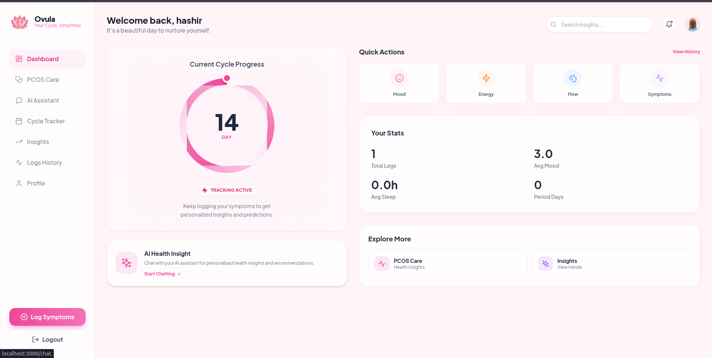
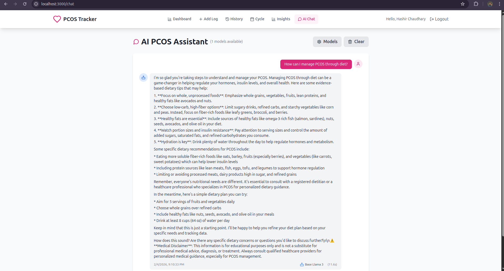
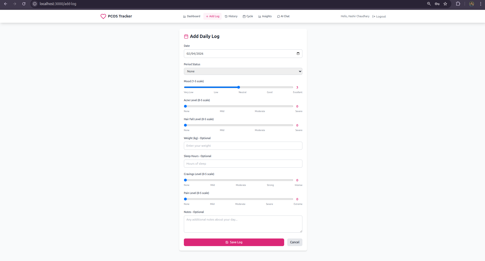
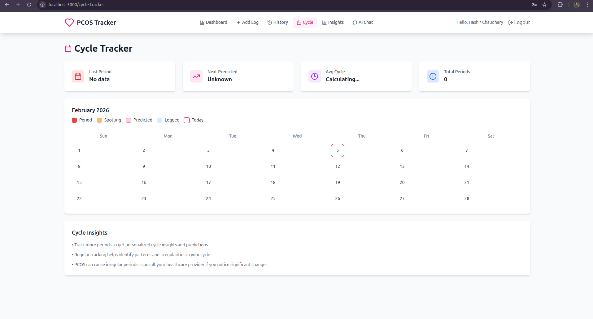
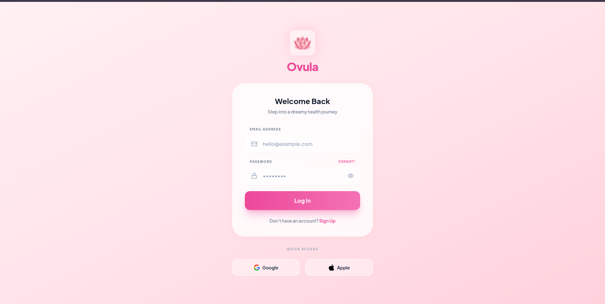
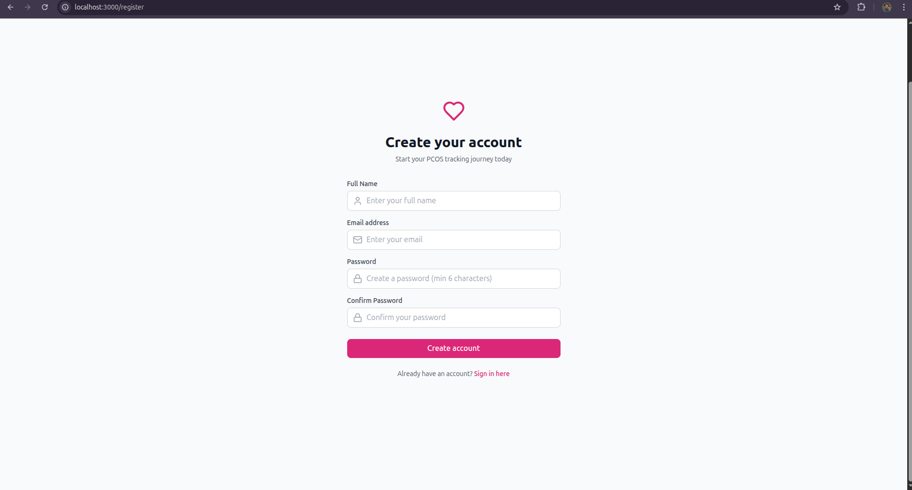

<div align="center">


# Ovula

### PCOS Tracking & AI Healthcare Assistant

*A Final Year Project combining machine learning, LLM fine-tuning, and a full-stack mobile + web application for PCOS management*

[](https://www.python.org/downloads/)
[](https://reactnative.dev/)
[](https://fastapi.tiangolo.com/)
[](https://ollama.ai/)
[](LICENSE)

[Overview](#-overview) • [Features](#-features) • [Tech Stack](#-tech-stack) • [Project Structure](#-project-structure) • [Quick Start](#-quick-start) • [Team](#-team)

</div>

---

## 🎓 Academic Research Project

<table>
<tr>
<td><strong>🏛️ University</strong></td>
<td>FAST National University of Computer and Emerging Sciences</td>
</tr>
<tr>
<td><strong>📍 Campus</strong></td>
<td>Peshawar</td>
</tr>
<tr>
<td><strong>📚 Project Type</strong></td>
<td>Final Year Project (FYP) — Machine Learning, NLP & Mobile Development</td>
</tr>
<tr>
<td><strong>🔬 Research Area</strong></td>
<td>Domain-Specific LLM Fine-Tuning & PCOS Healthcare</td>
</tr>
<tr>
<td><strong>👨‍🏫 Supervisor</strong></td>
<td>Shahzeb Khan</td>
</tr>
</table>

### 👥 Team

| Name | Reg. No | GitHub |
|------|---------|--------|
| **Muhammad Hashir** | 22P-9181 | [@hashirch](https://github.com/hashirch) |
| **Laraib Shahid Abbasi** | 22P-0503 | [@Laraibshahid89](https://github.com/Laraibshahid89) |
| **Arooba Gohar** | 22P-9216 | [@uroobagh123](https://github.com/uroobagh123) |

---

## 🌸 Overview

Ovula is a PCOS (Polycystic Ovary Syndrome) health companion built as our Final Year Project at FAST NUCES Peshawar. The project has two main angles: fine-tuning open-source LLMs to be better at answering PCOS-related questions, and building an actual app that people can use to track their symptoms, menstrual cycles, and get AI-powered health insights.

PCOS affects roughly 1 in 10 women globally, but general-purpose AI models tend to give pretty vague answers on the topic. We wanted to see how much better a domain-fine-tuned model could do — and package that into something usable.

---

## ✨ Features

### Mobile App (React Native)
- **Dashboard** — personalized health overview and recent activity
- **Symptom Logging** — daily log entries for symptoms, mood, weight, and more
- **Cycle Tracker** — menstrual cycle tracking with period prediction
- **AI Chat** — conversational interface powered by the fine-tuned Llama model
- **Logs History** — browse and review past health logs
- **User Profile** — manage account and health settings
- **Auth Flow** — register, login, and email OTP verification

### Backend (FastAPI)
- JWT-based authentication with email OTP verification
- Symptom log management (create, read, history)
- PCOS risk prediction using trained ML models
- AI-generated health insights from logs
- SQLite database with a clean schema

### ML Models
- **PCOS Risk Prediction** using KNN, Decision Tree, Logistic Regression, and Naive Bayes — best model selected for the backend prediction route
- Trained on a curated PCOS dataset

### LLM Fine-Tuning (AI Models)
- Base model: `llama-3.2-1b-instruct` (Q8_0 GGUF)
- Fine-tuned via Ollama using custom Modelfiles
- PCOS-specific system prompts and training configuration
- Separate Modelfiles for base vs fine-tuned comparison

### Web Frontend (React)
- Admin/comparison dashboard built with React and Tailwind CSS
- Visualizes model responses and user interaction logs

---

## 🛠 Tech Stack

### Mobile
```
React Native 0.73 (TypeScript)
├── React Navigation    — screen navigation
├── Axios               — API communication
├── AsyncStorage        — local session storage
└── React Native        — UI components
```

### Backend
```
Python / FastAPI
├── SQLAlchemy          — ORM & database models
├── Pydantic            — request/response validation
├── JWT                 — authentication tokens
├── OTP Service         — email-based verification
└── SQLite              — local database (pcos_tracker.db)

API Routers:
├── /auth               — register, login, OTP
├── /logs               — symptom log CRUD
├── /prediction         — PCOS risk scoring
└── /insights           — AI-generated health insights
```

### Machine Learning
```
Python / scikit-learn
├── KNN
├── Decision Tree
├── Logistic Regression
└── Naive Bayes         — all evaluated; best model deployed
```

### LLM / AI
```
Ollama + Llama 3.2 (1B, quantized Q8_0)
└── Custom Modelfiles for PCOS domain fine-tuning
```

### Web Frontend
```
React 18 + Tailwind CSS
└── Interactive dashboard for model comparison
```

---

## 📁 Project Structure

```
ovula/
│
├── 📂 mobile/                          # React Native App (main user-facing product)
│   ├── src/
│   │   ├── screens/                    # App screens
│   │   │   ├── LoginScreen.js
│   │   │   ├── RegisterScreen.js
│   │   │   ├── VerifyEmailScreen.js
│   │   │   ├── DashboardScreen.js
│   │   │   ├── AddLogScreen.js
│   │   │   ├── LogsHistoryScreen.js
│   │   │   ├── CycleTrackerScreen.js
│   │   │   ├── ChatScreen.js
│   │   │   └── ProfileScreen.js
│   │   ├── navigation/                 # Stack/tab navigator setup
│   │   ├── contexts/                   # Auth context / state
│   │   ├── services/                   # API service layer
│   │   ├── components/                 # Shared components
│   │   ├── styles/                     # Global styles
│   │   └── utils/                      # Helper utilities
│   └── android/ ios/                   # Native project files
│
├── 📂 backend/                         # FastAPI Backend
│   ├── main.py                         # App entry point
│   ├── models.py                       # Database models
│   ├── schemas.py                      # Pydantic schemas
│   ├── database.py                     # DB connection
│   ├── auth.py                         # Auth helpers
│   ├── otp_service.py                  # Email OTP logic
│   ├── database_schema.sql             # SQL schema reference
│   ├── requirements.txt
│   └── routers/
│       ├── auth.py                     # Auth routes
│       ├── logs.py                     # Symptom log routes
│       ├── prediction.py               # ML prediction routes
│       └── insights.py                 # AI insights routes
│
├── 📂 ml-models/                       # Classical ML for PCOS prediction
│   ├── src/
│   │   ├── models/
│   │   │   ├── knnprediction.py
│   │   │   ├── decisiontree.py
│   │   │   ├── logisticregression.py
│   │   │   ├── naivebayesprediction.py
│   │   │   └── train_best_model.py     # Selects & saves best model
│   │   └── data/                       # Feature processing scripts
│   └── data/                           # Raw / interim / processed datasets
│
├── 📂 ai-models/                       # LLM Fine-Tuning
│   ├── Modelfile                       # Primary fine-tuned Modelfile
│   ├── Modelfile_PCOS                  # PCOS-specific tuning config
│   ├── Modelfile_Base_PCOS             # Base model for comparison
│   └── llama-3.2-1b-instruct.Q8_0.gguf  # Quantized base model
│
├── 📂 frontend/                        # React Web Dashboard
│   ├── src/
│   │   ├── pages/                      # App pages (10 pages)
│   │   ├── components/
│   │   ├── contexts/
│   │   └── App.js
│   └── public/
│       └── ovula-logo.png
│
├── 📂 docs/                            # Documentation & screenshots
│   ├── ovula-logo.png
│   └── screenshots/
│       ├── dashboard.png
│       ├── chat.png
│       ├── add-log.png
│       ├── cycle-tracker.png
│       ├── login.png
│       └── register.png
│
├── start_backend.sh                    # One-shot backend startup
├── start_frontend.sh                   # One-shot frontend startup
└── README.md
```

---

## 📸 App Screenshots

<div align="center">

### 🏠 Dashboard

*Main screen showing health summary and recent activity*

### 💬 AI Chat

*Conversational AI powered by the fine-tuned Llama model*

### 📝 Symptom Log

*Daily symptom and health tracking*

### 🌙 Cycle Tracker

*Period tracking and prediction*

### 🔐 Authentication
<table>
<tr>
<td width="50%">

<p align="center"><em>Login</em></p>
</td>
<td width="50%">

<p align="center"><em>Register</em></p>
</td>
</tr>
</table>

</div>

---

## 🚀 Quick Start

### Prerequisites

- Python 3.8+
- Node.js 18+
- [Ollama](https://ollama.ai/) installed and running
- Android Studio or Xcode for mobile development

### 1. Clone the Repo

```bash
git clone https://github.com/hashirch/ovula.git
cd ovula
```

### 2. Start the Backend

```bash
cd backend
pip install -r requirements.txt
# copy .env.example to .env and fill in values
python main.py
```

Or use the helper script from the root:

```bash
./start_backend.sh
```

Backend runs at `http://localhost:8000` — API docs at `http://localhost:8000/docs`.

### 3. Run the Mobile App

```bash
cd mobile
npm install
npx react-native run-android   # or run-ios
```

### 4. Run the Web Frontend

```bash
cd frontend
npm install
npm start
./start_frontend.sh   # or use the root script
```

Frontend runs at `http://localhost:3000`.

### 5. Set Up the LLM

```bash
# Pull and create the fine-tuned model
ollama create pcos-llama -f ai-models/Modelfile_PCOS

# Test it
ollama run pcos-llama "What are the early signs of PCOS?"
```

---

## 🔬 LLM Fine-Tuning

We used Ollama with a locally quantized Llama 3.2 1B model (Q8_0) as our base. Fine-tuning was done by writing custom Modelfiles with PCOS-specific system prompts, behavioral constraints, and training parameters.

Three Modelfiles exist for comparison:
- `Modelfile_Base_PCOS` — base Llama with minimal PCOS context (baseline)
- `Modelfile_PCOS` — PCOS-specialized system prompt
- `Modelfile` — final tuned version used in production

```bash
# Create all three for comparison
ollama create pcos-base -f ai-models/Modelfile_Base_PCOS
ollama create pcos-v1   -f ai-models/Modelfile_PCOS
ollama create pcos      -f ai-models/Modelfile
```

---

## 🤖 ML Prediction Models

The `/prediction` backend route uses the best-performing classical ML model for PCOS risk scoring. We trained and evaluated four models:

| Model | Notes |
|-------|-------|
| K-Nearest Neighbors | Solid baseline, good on smaller datasets |
| Decision Tree | Interpretable, fast inference |
| Logistic Regression | Lightweight, reliable |
| Naive Bayes | Fast, works well with independent features |

`train_best_model.py` evaluates all four and saves the best-performing one for use in the API.

---

## ⚠️ Disclaimer

Ovula is a research and educational project. The AI responses and PCOS risk scores are **not a substitute for professional medical advice**. Always consult a qualified healthcare provider for any health concerns.

---

## 📄 License

MIT License — see [LICENSE](LICENSE) for details.

---

## 🙏 Acknowledgments

- **Shahzeb Khan** — project supervisor
- **FAST NUCES Peshawar** — resources and infrastructure
- **Meta AI** — Llama 3.2 model
- **Ollama** — local LLM inference platform
- **Hugging Face** — model tooling and ecosystem

---

<div align="center">

**Made with ❤️ by the Ovula team at FAST NUCES Peshawar**

**[⬆ Back to Top](#-ovula)**

</div>
