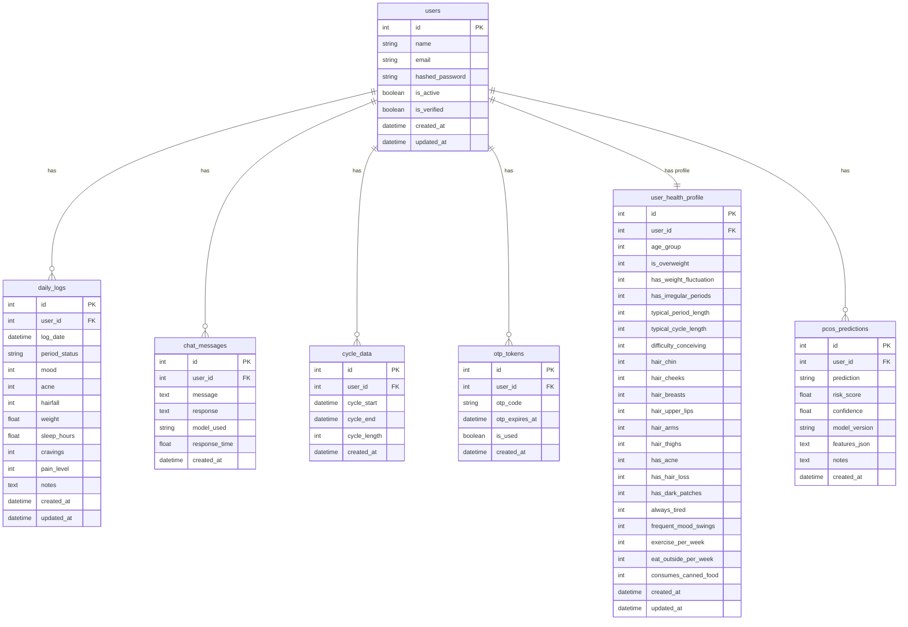

# Entity-Relationship (ER) Diagram

Here is the Entity-Relationship diagram illustrating the database schema for the PCOS Tracking System based on the SQLAlchemy models.

```mermaid
erDiagram
    users ||--o{ daily_logs : "has"
    users ||--o{ chat_messages : "has"
    users ||--o{ cycle_data : "has"
    users ||--o{ otp_tokens : "has"
    users ||--|| user_health_profile : "has profile"
    users ||--o{ pcos_predictions : "has"

    users {
        int id PK
        string name
        string email
        string hashed_password
        boolean is_active
        boolean is_verified
        datetime created_at
        datetime updated_at
    }

    daily_logs {
        int id PK
        int user_id FK
        datetime log_date
        string period_status
        int mood
        int acne
        int hairfall
        float weight
        float sleep_hours
        int cravings
        int pain_level
        text notes
        datetime created_at
        datetime updated_at
    }

    chat_messages {
        int id PK
        int user_id FK
        text message
        text response
        string model_used
        float response_time
        datetime created_at
    }

    cycle_data {
        int id PK
        int user_id FK
        datetime cycle_start
        datetime cycle_end
        int cycle_length
        datetime created_at
    }

    otp_tokens {
        int id PK
        int user_id FK
        string otp_code
        datetime otp_expires_at
        boolean is_used
        datetime created_at
    }

    user_health_profile {
        int id PK
        int user_id FK
        int age_group
        int is_overweight
        int has_weight_fluctuation
        int has_irregular_periods
        int typical_period_length
        int typical_cycle_length
        int difficulty_conceiving
        int hair_chin
        int hair_cheeks
        int hair_breasts
        int hair_upper_lips
        int hair_arms
        int hair_thighs
        int has_acne
        int has_hair_loss
        int has_dark_patches
        int always_tired
        int frequent_mood_swings
        int exercise_per_week
        int eat_outside_per_week
        int consumes_canned_food
        datetime created_at
        datetime updated_at
    }

    pcos_predictions {
        int id PK
        int user_id FK
        string prediction
        float risk_score
        float confidence
        string model_version
        text features_json
        text notes
        datetime created_at
    }
```
